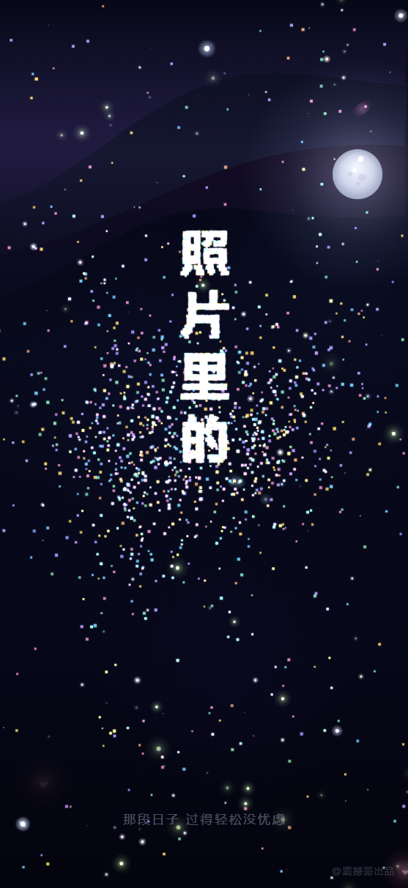

# Starry Night Music Player

[中文文档](README.zh-CN.md)

## Overview

An immersive sleep music player featuring stunning visual effects including starry skies, meteor showers, moonlight, and fireflies. Designed to provide users with a peaceful and serene nighttime music experience.

## ✨ Features

- **Dynamic Starry Background** - Twinkling stars that pulse with the music rhythm
- **Meteor Shower Effects** - Shooting stars across the night sky creating a romantic atmosphere
- **Moonlight Animation** - Slowly drifting moon that breathes with the melody
- **Fireflies** - Warm fireflies wandering through the night sky
- **Lyrics Display** - Synchronized lyrics with star particle text effects
- **Elegant Player** - Frosted glass effect player interface
- **Audio Visualization** - Background effects respond to music rhythm

## 🎵 Usage

1. Clone the repository to your local machine
2. Open `index.html` in your web browser
3. Click the play button to start playing music
4. Click on empty space to hide/show the player

## 📁 File Structure

- `index.html` - Main player page
- `index2.html`, `index3.html`, etc. - Different versions of the player
- `star.html` - Star effect version
- `music/` - Music files directory
- `*.lrc` - Lyrics files
- `*.mp3` - Audio files

## 🛠️ Tech Stack

- HTML5 Canvas
- Web Audio API
- CSS3 Animations
- Vanilla JavaScript

## 📝 License

MIT License

---

**Created by @震撼哥**
